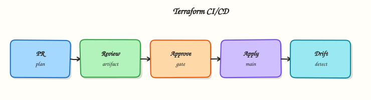

# Terraform in CI/CD Pipelines

## Overview

Production Terraform is applied by **pipelines**, not laptops. Pull requests run format, validate, test, and **plan**; protected branches or environments run **apply** of a reviewed plan with short-lived credentials. Store the binary plan as an artefact so apply executes exactly what reviewers approved.

This is **Tutorial 16** in **Module 16: CI/CD** of the REBASH Academy **Terraform for Cloud & DevOps Engineers** series — written for engineers wiring Terraform into GitHub Actions, GitLab CI, Azure DevOps, Jenkins, or Atlantis.

Beginners learn the plan/apply split. Practitioners configure Actions expressions, OIDC, and artefact retention. Production judgement covers fork PR trust, least-privilege roles, and when Atlantis chatops beats YAML pipelines.

## Prerequisites

- [Terraform Security and Secrets](terraform-security-and-secrets.md)
- Terraform CLI 1.9+
- Basic familiarity with GitHub Actions workflow syntax (lab simulates CI locally)

## Learning Objectives

By the end of this tutorial, you will be able to:

- [ ] Separate PR plan jobs from privileged apply jobs
- [ ] Use `TF_IN_AUTOMATION` and `-input=false` correctly
- [ ] Store and consume plan artefacts safely
- [ ] Sketch GitHub Actions, GitLab CI, Azure DevOps, and Jenkins patterns
- [ ] Explain when Atlantis fits versus native CI YAML

## Architecture

CI/CD wraps the Terraform workflow with gates, credentials, artefacts, and approval boundaries.



## Theory

### What it is

**Terraform in CI/CD** means automated machines run the write → plan → apply loop with auditability:

| Stage | Trigger | Typical privilege |
|-------|---------|-------------------|
| fmt / validate / test | Every PR | Low — often no cloud write |
| `terraform plan -out=` | Every PR | Read / plan role |
| Human + policy review | PR approval | — |
| `terraform apply tfplan` | Protected branch / environment | Apply role |

**GitHub Actions** uses workflow YAML under `.github/workflows/`. **GitLab CI** uses `.gitlab-ci.yml` with environments. **Azure DevOps** uses pipeline YAML and service connections. **Jenkins** uses Declarative or Scripted Pipeline with credential bindings. **Atlantis** is a pull-request automation server: comment `atlantis plan` / `atlantis apply`, lock directories, and attach plans to PR conversations.

Automation flags: `TF_IN_AUTOMATION=true` and `-input=false` keep jobs non-interactive. Pin Terraform versions (setup action or container image) so CI matches local and HCP Terraform agents.

### Why it matters

Laptop apply bypasses review, uses personal credentials, and leaves inconsistent audit trails. Pipelines enforce format/test gates, OIDC roles, state locking, and environment protections (required reviewers, wait timers). Plan artefacts prevent “plan on Tuesday, apply different code on Wednesday” drift between review and merge.

### How it works

1. **On pull request:** checkout → setup Terraform → `fmt -check` → `init` → `validate` → `test` / `tflint` → `plan -out=tfplan` → upload artefact with restricted retention.
2. **Review:** attach human-readable plan summary; run policy on JSON if required.
3. **On merge to protected branch:** download the same plan artefact (or re-plan under strict controls) → `apply -input=false tfplan` with apply role.
4. **Credentials:** OIDC to AWS/Azure/GCP — avoid long-lived keys in repository secrets when possible.
5. **Atlantis alternative:** VCS webhook → Atlantis runs plan/apply in its VPC using `atlantis.yaml` project definitions and workspace locking.

Prefer apply-of-saved-plan for production; re-plan on main only when change control explicitly allows it and locking prevents races.

### Key concepts and comparisons

| System | Strength | Watch-outs |
|--------|----------|------------|
| GitHub Actions | OIDC to clouds, environments | Protect plan artefacts; fork PR trust |
| GitLab CI | Environments, OIDC | Same artefact discipline |
| Azure DevOps | Enterprise approval gates | Scope service connections |
| Jenkins | Flexible agents | Credential sprawl if unmanaged |
| Atlantis | PR-native UX, locking | Host hardening; apply authorisation |

### GitLab CI sketch

GitLab uses `terraform plan` in a `plan` job with `artifacts: paths: [tfplan]` and a manual `apply` job on protected environments — same artefact pattern as Actions, different YAML keys (`environment:`, `id_tokens:` for OIDC).

### Azure DevOps sketch

Pipeline stages separate `Plan` and `Apply` with environment approvals on `Apply`. Service connections hold cloud credentials — scope them per subscription/project, not one org-wide admin connection.

### Jenkins sketch

Declarative pipeline: stage `Plan` archives `tfplan`; stage `Apply` runs only on `main` with `input` approval and credentials bound from Jenkins Credential Store — watch for credential exposure in console logs (`set +x` around secret exports).

### Atlantis sketch

`atlantis.yaml` maps directories to workflows. Engineers comment `atlantis plan -d envs/prod` on PRs; Atlantis locks the directory, posts plan output, and applies after approval comment — ideal when teams live in VCS review UI.

### Common pitfalls

- Applying from a fresh plan on main without tying to the reviewed PR plan.
- Logging full plans that contain sensitive attribute values.
- One static admin key for all environments.
- Letting fork PRs run apply-capable workflows.
- Skipping state locking so two pipelines apply concurrently.

## Hands-on Lab

### Objective

Author a GitHub Actions plan workflow and a local CI simulator script that runs the same gates (`fmt`, `validate`, saved plan, **apply**) against a real **Docker** stack under `~/rebash-terraform/module-16`.

### Prerequisites

- Terraform CLI ≥ 1.9
- Docker Engine running (`docker info` succeeds)

### Lab environment

Workspace: `~/rebash-terraform/module-16`

``` {.bash .ra-terminal title="Terminal"}
mkdir -p ~/rebash-terraform/module-16/{.github/workflows,infra,scripts,artefacts} && cd ~/rebash-terraform/module-16
```

### Real-world scenario

Platform engineering requires every infrastructure pull request to upload a saved plan artefact and pass format/validate gates before merge. Production apply runs only from the protected branch with manual approval. You build the workflow YAML and prove the same steps locally — including apply of a running container.

### Step-by-step tasks

#### Task 1 – Create Docker Terraform stack

Create `infra/versions.tf`:

```hcl title="versions.tf"
terraform {
  required_version = ">= 1.9.0"

  required_providers {
    docker = {
      source  = "kreuzwerker/docker"
      version = "~> 3.0"
    }
  }
}
```

Create `infra/providers.tf`:

```hcl title="providers.tf"
provider "docker" {}
```

Create `infra/main.tf`:

```hcl title="main.tf"
resource "docker_image" "ci_demo" {
  name         = "nginx:1.27-alpine"
  keep_locally = true
}

resource "docker_container" "ci_demo" {
  name  = "module-16-cicd-lab"
  image = docker_image.ci_demo.image_id

  labels = {
    purpose  = "module-16-cicd-lab"
    revision = "1"
    managed_by = "terraform"
  }

  ports {
    internal = 80
    external = 0
  }
}
```

Create `infra/outputs.tf`:

```hcl title="outputs.tf"
output "container_name" {
  value = docker_container.ci_demo.name
}

output "purpose" {
  value = docker_container.ci_demo.labels.purpose
}
```

Validate locally:

``` {.bash .ra-terminal title="Terminal"}
cd ~/rebash-terraform/module-16/infra
terraform init -backend=false | tee ../artefacts/init.log
terraform validate | tee ../artefacts/validate.log
```

!!! example "Expected output"
    `artefacts/validate.log` contains `Success! The configuration is valid.`


#### Task 2 – Author GitHub Actions plan workflow

Create `.github/workflows/terraform-plan.yml`:


```yaml
name: Terraform Plan
on:
  pull_request:
    paths:
      - 'infra/**'
      - '.github/workflows/terraform-plan.yml'
  workflow_dispatch:

permissions:
  contents: read
  pull-requests: write

env:
  TF_IN_AUTOMATION: true

jobs:
  plan:
    runs-on: ubuntu-latest
    defaults:
      run:
        working-directory: infra
    steps:
      - name: Checkout
        uses: actions/checkout@v4

      - name: Setup Terraform
        uses: hashicorp/setup-terraform@v3
        with:
          terraform_version: 1.9.8

      - name: Format check
        run: terraform fmt -check -recursive

      - name: Init
        run: terraform init -backend=false

      - name: Validate
        run: terraform validate

      - name: Plan
        run: terraform plan -input=false -out=tfplan

      - name: Upload plan artefact
        uses: actions/upload-artifact@v4
        with:
          name: tfplan-${{ github.sha }}
          path: infra/tfplan
          retention-days: 5
```


Verify YAML file exists:

``` {.bash .ra-terminal title="Terminal"}
cd ~/rebash-terraform/module-16
test -f .github/workflows/terraform-plan.yml
grep -q 'terraform fmt -check' .github/workflows/terraform-plan.yml
grep -q 'upload-artifact' .github/workflows/terraform-plan.yml
```

!!! example "Expected output"
    Both `grep` commands exit 0.


#### Task 3 – Local CI simulator (fmt, validate, plan, apply)

Create `scripts/simulate-ci.sh`:


``` {.bash .ra-terminal title="Terminal"}
#!/usr/bin/env bash
set -euo pipefail

ROOT="$(cd "$(dirname "${BASH_SOURCE[0]}")/.." && pwd)"
export TF_IN_AUTOMATION=true

cd "$ROOT/infra"
terraform fmt -check -recursive
terraform init -backend=false
terraform validate
terraform plan -input=false -out=tfplan
terraform show -no-color tfplan > "$ROOT/artefacts/plan-review.txt"
cp tfplan "$ROOT/artefacts/tfplan"
test -s "$ROOT/artefacts/plan-review.txt"

terraform apply -input=false tfplan
docker ps --filter "name=module-16-cicd-lab" --format '{{.Names}} {{.Status}}' \
  > "$ROOT/artefacts/container-ps.txt"
grep -q 'module-16-cicd-lab' "$ROOT/artefacts/container-ps.txt"
echo "simulate-ci: OK"
```


Run the simulator:

``` {.bash .ra-terminal title="Terminal"}
cd ~/rebash-terraform/module-16
chmod +x scripts/simulate-ci.sh
./scripts/simulate-ci.sh | tee artefacts/simulate-ci.log
grep -q 'simulate-ci: OK' artefacts/simulate-ci.log
grep -q 'docker_container.ci_demo' artefacts/plan-review.txt
grep -q 'running' artefacts/container-ps.txt
```

!!! example "Expected output"
    Plan review lists container; apply creates running `module-16-cicd-lab` container.


#### Task 4 – Prove saved-plan apply discipline

Re-run plan and apply saved artefact explicitly (merge simulation):


``` {.bash .ra-terminal title="Terminal"}
cd ~/rebash-terraform/module-16/infra
terraform plan -input=false -out=../artefacts/merge.tfplan | tee ../artefacts/plan-merge.log
terraform apply -input=false ../artefacts/merge.tfplan | tee ../artefacts/apply-merge.log
docker inspect module-16-cicd-lab --format '{{index .Config.Labels "managed_by"}}' \
  | tee ../artefacts/label-proof.txt
grep -q 'terraform' ../artefacts/label-proof.txt
```


!!! example "Expected output"
    No unexpected changes on re-apply; container label `managed_by=terraform`.


### Validation steps

- [ ] `.github/workflows/terraform-plan.yml` authored with Actions expressions wrapped for MkDocs
- [ ] `scripts/simulate-ci.sh` reproduces fmt, validate, plan, and **apply** offline
- [ ] Running Docker container proves apply succeeded
- [ ] `TF_IN_AUTOMATION=true` set in workflow and simulator
- [ ] Saved plan artefact captured before apply

### Common errors and fixes

| Error | Cause | Fix |
|-------|-------|-----|
| fmt-check fails in CI | Unformatted HCL | Run `terraform fmt -recursive` locally; commit |
| Docker not available in CI | Missing service | Add Docker setup step or use self-hosted runner |
| Apply changes unexpectedly | Used implicit apply after config drift | Apply explicit `tfplan` binary |
| Container name conflict | Leftover from prior run | `terraform destroy`; `docker rm -f module-16-cicd-lab` |

### Challenge exercise

Add `.github/workflows/terraform-apply.yml` with `push` to `main`, `environment: production`, and document in `docs/apply-gate.md` why fork PRs must not trigger apply jobs.

### Learning outcomes

- Authored a GitHub Actions plan workflow with artefact upload
- Ran equivalent fmt/validate/plan/**apply** gates locally via `scripts/simulate-ci.sh`
- Proved infrastructure with `docker ps` after apply
- Understood where GitLab, Azure DevOps, Jenkins, and Atlantis map to the same stages

### Cleanup

``` {.bash .ra-terminal title="Terminal"}
cd ~/rebash-terraform/module-16/infra
terraform destroy -auto-approve
cd ~/rebash-terraform/module-16
rm -rf infra/.terraform infra/tfplan artefacts
```

## Validation

- [ ] Lab completed under `~/rebash-terraform/module-16`
- [ ] Workflow YAML uses create-file pattern (not shell heredocs)
- [ ] You can explain plan vs apply job separation
- [ ] You can describe one production failure mode (fork PR apply)

## Code Walkthrough

Production CI habits:

1. **Inspect plan artefacts** — destroys and replacements require explicit reviewer acknowledgement.
2. **Pin Terraform version** in workflow and local devcontainers identically.
3. **Capture evidence** — upload plan text and run URL to change tickets.
4. **OIDC over static keys** — federation to cloud IAM with environment-scoped roles.
5. **Concurrency controls** — one apply per branch/workspace at a time.

## Security Considerations

- Never run apply workflows on fork pull requests with write credentials.
- Restrict plan artefact download to protected branches and trusted actors.
- Mask secrets in Actions expressions — inject via environment variables, not echoed commands.
- Scope OIDC `sub` claim conditions to repository and environment.
- Truncate plan logs posted to PR comments if they may contain sensitive values.

## Common Mistakes

!!! warning "Re-planning on main instead of applying reviewed artefact"
    **Fix:** Download PR plan artefact or require apply job uses the same commit SHA’s saved plan.

!!! warning "Admin cloud key in repository secrets"
    **Fix:** Migrate to OIDC; rotate and delete static keys.

!!! warning "Skipping environment protection on apply"
    **Fix:** Require reviewers on `environment: production` (or equivalent) before apply job starts.

## Best Practices

- Run fmt, validate, and test before plan in every PR.
- Upload plan binary with short retention; store human-readable summary separately.
- Use concurrency groups to prevent parallel applies to one state.
- Pin `hashicorp/setup-terraform` and provider versions.
- Document Atlantis vs Actions choice in platform ADRs (Architecture Decision Records).

## Troubleshooting

| Symptom | Likely cause | Fix |
|---------|--------------|-----|
| Plan job ok, apply auth fails | Wrong OIDC trust or role ARN | Verify cloud trust policy matches repo/environment |
| Stale plan applied | New commits after plan | Re-run plan on merge commit; block apply if SHA mismatch |
| Duplicate resources | Concurrent applies | Add concurrency; enforce state lock |
| Atlantis lock stuck | Previous PR abandoned | Admin unlock after verifying no partial apply |
| Jenkins secret in console | `set -x` with env export | Disable xtrace; use masked credentials |

## Summary

CI/CD separates low-privilege plan jobs on pull requests from apply jobs on protected branches, using saved plan artefacts and short-lived credentials. The lab authored a GitHub Actions workflow and offline simulator with the same gates. Next, model **multi-cloud** interfaces with provider aliases and facade modules.

## Interview Questions

**1. What is a typical PR plan / merge apply pipeline shape?**

??? success "Reveal answer"
    PR: fmt → validate → test → plan → upload artefact → review. Merge to protected branch: download artefact (or strict re-plan) → policy check → manual approval → apply saved plan with apply role.

**2. Why apply a saved plan file rather than re-planning on apply?**

??? success "Reveal answer"
    Re-planning can pick up provider upgrades, drift, or new commits reviewers never saw. Applying the exact plan binary preserves the reviewed intent.

**3. How does OIDC improve cloud authentication from CI?**

??? success "Reveal answer"
    The CI platform mints a short-lived token; cloud IAM trusts the issuer and returns a scoped role session — no long-lived access keys stored in GitHub/GitLab secrets.

**4. What blast-radius controls belong in Terraform pipelines?**

??? success "Reveal answer"
    Separate plan/apply roles, environment protections, remote state locking, concurrency limits, policy on plans, and no apply on fork PRs.

**5. How do you prevent unreviewed applies to production?**

??? success "Reveal answer"
    Require PR review, environment approval gates, apply only from protected branches, and tie apply jobs to saved plan artefacts from the reviewed SHA.

**6. When does Atlantis beat a plain GitHub Actions workflow?**

??? success "Reveal answer"
    When teams want plan/apply commands in PR comments, automatic directory locking, and less YAML maintenance — common in large monorepos with many Terraform roots.

**7. What do `TF_IN_AUTOMATION` and `-input=false` signal?**

??? success "Reveal answer"
    Non-interactive automation mode — Terraform skips prompts and adjusts messaging for CI logs; combined with explicit variables prevents hung jobs waiting for stdin.

## Related Tutorials

- [Course overview](index.md)
- [Terraform Security and Secrets](terraform-security-and-secrets.md)
- [Multi-Cloud Terraform](multi-cloud-terraform.md)

## References

- [Automating Terraform](https://developer.hashicorp.com/terraform/cli/run/automating-terraform)
- [GitHub Actions — OIDC with AWS](https://docs.github.com/en/actions/deployment/security-hardening-your-deployments/configuring-openid-connect-with-amazon-web-services)
- [hashicorp/setup-terraform](https://github.com/hashicorp/setup-terraform)
- [Atlantis](https://www.runatlantis.io/)
