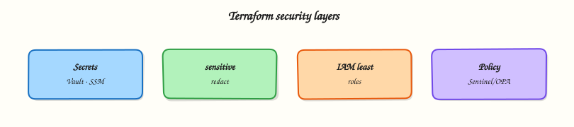

# Terraform Security and Secrets

## Overview

Terraform plans and state files are attractive targets — they often contain database endpoints, tokens, and identity details. A secure workflow keeps secrets out of Git, marks sensitive values correctly, injects credentials from vaults at runtime, scopes IAM (Identity and Access Management) for CI runners, encrypts remote state, and blocks unsafe plans with policy as code.

This is **Tutorial 15** in **Module 15: Security** of the REBASH Academy **Terraform for Cloud & DevOps Engineers** series — written for engineers implementing DevSecOps on Infrastructure as Code (IaC).

Beginners learn that `sensitive = true` redacts CLI output but **not** state. Practitioners adopt Vault, AWS Systems Manager (SSM) Parameter Store, or Secrets Manager patterns. Production judgement covers encrypted backends, plan artefact handling, and OPA versus Sentinel trade-offs.

## Prerequisites

- [Format, Validate, and Terraform Test](format-validate-and-terraform-test.md)
- Terraform CLI 1.9+

## Learning Objectives

By the end of this tutorial, you will be able to:

- [ ] List secret anti-patterns in HCL, tfvars, and state
- [ ] Mark variables and outputs `sensitive` and explain their limits
- [ ] Outline HashiCorp Vault, SSM, and Secrets Manager injection patterns
- [ ] Describe IAM least privilege for plan vs apply CI roles
- [ ] Explain state encryption and safe plan artefact retention
- [ ] Summarise Open Policy Agent (OPA) vs Sentinel for policy as code

## Architecture

Security layers wrap the Terraform workflow — secrets injection, identity, encrypted state, and policy on plans.



## Theory

### What it is

**Terraform security** spans secrets handling, identities used for plan/apply, protection of **state** (which often stores secret attribute values), and **policy as code** constraining what infrastructure may be created.

| Concern | Secure default |
|---------|----------------|
| Secrets in Git | Never commit plaintext; inject via CI or secret store |
| Sensitive attributes | `sensitive = true` on vars/outputs; still stored in state |
| Injection | Data sources reading Vault, SSM, Secrets Manager |
| Identity | Short-lived OpenID Connect (OIDC) roles; least privilege per root |
| State | Remote backend with encryption and tight access control lists (ACLs) |
| Policy | OPA/Conftest or Sentinel on plan JSON |

Marking a variable `sensitive = true` suppresses values in CLI output — it does **not** encrypt state. Real secrecy requires external stores, minimising secret material in resource attributes, and locking down backend access.

### Why it matters

State files and plan artefacts are high-value targets. A compromised CI role with broad `*` permissions can recreate or destroy entire landing zones. DevSecOps treats Terraform like production application code — provenance of modules, pinned providers, encrypted backends, and policy gates — because IaC is both a supply chain and a privileged control plane.

### How it works

1. **Secret management:** keep committed HCL and tfvars free of passwords; inject via environment variables, CI-masked inputs, or data sources reading Vault/SSM/Secrets Manager at plan/apply time.
2. **Sensitive flags:** mark outputs that could leak secrets; never pipe `terraform output -json` into public logs. Remember state still stores values — encrypt the backend.
3. **Vault integration:** use the Vault provider or external data sources to fetch dynamic credentials; prefer short-lived database users over static passwords in state.
4. **IAM best practices:** CI assumes an OIDC-federated role scoped to one environment; separate plan-only and apply-capable roles where possible.
5. **State encryption:** Amazon S3, Google Cloud Storage, Azure Blob, or HCP Terraform with server-side encryption, versioning, no public access.
6. **Policy as code:** after `terraform plan -out=tfplan`, export JSON and evaluate rules — no public S3 buckets, required tags, forbidden instance types.

### Key concepts and comparisons

| Anti-pattern | Better pattern |
|--------------|----------------|
| Password in committed tfvars | Vault / SSM / Secrets Manager reference |
| Long-lived cloud keys in CI | OIDC → short-lived role |
| Unencrypted state bucket | Server-side encryption + private ACL |
| Cluster-admin apply role | Environment-scoped least privilege |
| Manual plan review only | Automated policy + human approve for prod |

| Engine | Where it runs | Language |
|--------|---------------|----------|
| OPA / Conftest | Any CI | Rego |
| Sentinel | HCP Terraform / Enterprise | Sentinel |

### Common pitfalls

- Believing `sensitive = true` keeps values out of state — it does not.
- Printing full `terraform show` plan files into public CI logs.
- Storing `terraform.tfstate` in Git, even temporarily.
- Trusting module provenance while ignoring over-privileged IAM the module creates.
- Disabling policy fail-closed so a change “just applies”.

## Hands-on Lab

### Objective

Demonstrate sensitive variable handling, redacted CLI output, and plaintext persistence in state — using a **Docker container** with sensitive env vars and fake placeholder credentials only (never real secrets) under `~/rebash-terraform/module-15`.

### Prerequisites

- Terraform CLI ≥ 1.9
- Docker Engine running (`docker info` succeeds)
- `jq` optional for JSON inspection

### Lab environment

Workspace: `~/rebash-terraform/module-15`

```bash title="Terminal"
mkdir -p ~/rebash-terraform/module-15 && cd ~/rebash-terraform/module-15
```

### Real-world scenario

Security review flagged a service module that passed API tokens into container env vars without `sensitive` markers. You reproduce the leak pattern safely with a placeholder token, prove CLI redaction, inspect state to show why backend ACLs matter, and verify the container receives the env without exposing it in `terraform output`.

### Step-by-step tasks

#### Task 1 – Define sensitive inputs and Docker container with secret env

Create `versions.tf`:

```hcl title="versions.tf"
terraform {
  required_version = ">= 1.9.0"

  required_providers {
    docker = {
      source  = "kreuzwerker/docker"
      version = "~> 3.0"
    }
    local = {
      source  = "hashicorp/local"
      version = "~> 2.5"
    }
  }
}
```

Create `providers.tf`:

```hcl title="providers.tf"
provider "docker" {}
```

Create `variables.tf`:

```hcl title="variables.tf"
variable "api_token" {
  type        = string
  description = "Placeholder API token — inject from CI secret store in production."
  sensitive   = true
  default     = "lab-placeholder-token-do-not-use-in-prod"
}

variable "service_name" {
  type        = string
  description = "Logical service name for the container."
  default     = "payments-api"
}
```

Create `main.tf`:

```hcl title="main.tf"
resource "docker_image" "service" {
  name         = "nginx:1.27-alpine"
  keep_locally = true
}

resource "docker_container" "service" {
  name  = var.service_name
  image = docker_image.service.image_id

  env = [
    "SERVICE_NAME=${var.service_name}",
    "API_TOKEN=${var.api_token}",
  ]

  labels = {
    service_name = var.service_name
    has_secret   = "true"
  }
}

resource "local_file" "service_config" {
  filename        = "${path.module}/generated/service.env"
  file_permission = "0600"
  content         = "SERVICE_NAME=${var.service_name}\nAPI_TOKEN=${var.api_token}\n"
}
```

Create `outputs.tf`:

```hcl title="outputs.tf"
output "container_name" {
  description = "Running container name."
  value       = docker_container.service.name
}

output "api_token" {
  description = "Token reference — must stay sensitive."
  value       = var.api_token
  sensitive   = true
}

output "service_name" {
  description = "Non-sensitive service identifier."
  value       = var.service_name
}
```

Create `.gitignore`:

```gitignore title=".gitignore"
.terraform/
terraform.tfstate
terraform.tfstate.backup
generated/
*.tfvars
!*.tfvars.example
```

Initialise and validate:

```bash title="Terminal"
cd ~/rebash-terraform/module-15
mkdir -p generated artefacts
terraform init | tee artefacts/init.log
terraform validate | tee artefacts/validate.log
```

!!! example "Expected output"
    `validate.log` contains `Success! The configuration is valid.`


#### Task 2 – Apply and observe CLI redaction vs state persistence


```bash title="Terminal"
cd ~/rebash-terraform/module-15
terraform apply -auto-approve -input=false | tee artefacts/apply.log
terraform output | tee artefacts/output-redacted.txt
terraform output -json > artefacts/outputs.json
grep -q '<sensitive>' artefacts/output-redacted.txt || grep -q 'Sensitive value' artefacts/output-redacted.txt
grep -q 'lab-placeholder-token-do-not-use-in-prod' terraform.tfstate
docker inspect payments-api --format '{{range .Config.Env}}{{println .}}{{end}}' \
  | tee artefacts/container-env.txt
grep -q 'API_TOKEN=' artefacts/container-env.txt
grep -q 'lab-placeholder-token' artefacts/container-env.txt
test -f generated/service.env
stat -c '%a' generated/service.env 2>/dev/null || stat -f '%OLp' generated/service.env | tee artefacts/env-perms.txt
grep -q '600' artefacts/env-perms.txt || grep -q '0600' artefacts/env-perms.txt
```


!!! example "Expected output"
    CLI output hides token; state **contains** plaintext placeholder; container env has token; config file mode `0600`.


#### Task 3 – Document safe injection pattern

Create `secrets.tf.example`:

```hcl title="secrets.tf.example"
# Production pattern: fetch secrets outside committed files.
#
# data "aws_secretsmanager_secret_version" "api" {
#   secret_id = var.secret_arn
# }
#
# locals {
#   api_token = jsondecode(data.aws_secretsmanager_secret_version.api.secret_string)["token"]
# }
#
# Pass local.api_token to container env; never commit secret_arn with real IDs.
```

Create `terraform.tfvars.example`:

```hcl title="terraform.tfvars.example"
# Copy to terraform.tfvars locally — never commit real values.
service_name = "payments-api"
# api_token    = "<inject-via-TF_VAR_api_token-in-CI>"
```

Verify examples exist:

```bash title="Terminal"
cd ~/rebash-terraform/module-15
test -f secrets.tf.example
test -f terraform.tfvars.example
grep -q 'aws_secretsmanager_secret_version' secrets.tf.example
```

!!! example "Expected output"
    Example files document external injection without activating cloud providers.


#### Task 4 – Export plan JSON for policy stub

Create `policy/deny-plaintext-token.rego.example`:

```rego title="deny-plaintext-token.rego.example"
# Example OPA rule — evaluate against terraform show -json plan output.
package terraform.security

deny[msg] {
  some resource
  resource := input.resource_changes[_]
  resource.change.after.content
  contains(resource.change.after.content, "password=")
  msg := "plan writes plaintext password= into file content"
}
```

Generate plan JSON evidence:


```bash title="Terminal"
cd ~/rebash-terraform/module-15
terraform plan -input=false -out=artefacts/security.tfplan | tee artefacts/plan.log
terraform show -json artefacts/security.tfplan > artefacts/plan.json
test -s artefacts/plan.json
grep -q 'docker_container' artefacts/plan.json
docker ps --filter "name=payments-api" --format '{{.State}}' | tee artefacts/container-state.txt
grep -q 'running' artefacts/container-state.txt
```


!!! example "Expected output"
    `plan.json` references `docker_container`; container still running.


### Validation steps

- [ ] Sensitive output redacted in CLI (`terraform output`)
- [ ] Placeholder token visible in `terraform.tfstate` (demonstrates backend risk)
- [ ] Container receives env var; `generated/` paths listed in `.gitignore`
- [ ] `secrets.tf.example` shows external store pattern
- [ ] `plan.json` exported for policy tooling

### Common errors and fixes

| Error | Cause | Fix |
|-------|-------|-----|
| Token printed in CI log | Missing `sensitive = true` on output | Mark output sensitive; avoid echoing TF_VAR values |
| tfvars committed | No `.gitignore` entry | Ignore `*.tfvars`; keep `.example` only |
| State bucket public | Misconfigured ACL | Block public access; encrypt at rest |
| Container env empty | Apply failed silently | Check `terraform apply` log; verify Docker running |

### Challenge exercise

Add a `precondition` on `var.api_token` requiring `length(var.api_token) >= 20` and extend `policy/deny-plaintext-token.rego.example` with a deny rule for missing `file_permission = "0600"` on sensitive files.

### Learning outcomes

- Marked variables and outputs `sensitive` and observed CLI redaction
- Proved secrets still persist in state — motivating encrypted remote backends
- Applied sensitive values to real Docker container env
- Exported plan JSON suitable for OPA policy gates

### Cleanup

```bash title="Terminal"
cd ~/rebash-terraform/module-15
terraform destroy -auto-approve
rm -rf .terraform generated artefacts
rm -rf terraform.tfstate terraform.tfstate.backup
```

## Validation

- [ ] Lab completed under `~/rebash-terraform/module-15`
- [ ] You can explain sensitive vs encrypted state
- [ ] You did not use real credentials anywhere
- [ ] You can describe one production failure mode (public state bucket)

## Code Walkthrough

Production secret habits:

1. **Inspect state access** — who can `GetObject` on the state bucket or read HCP workspace state?
2. **Inject at runtime** — CI OIDC + secret store; no static keys in repository variables.
3. **Minimise secret attributes** — prefer references (ARN, secret name) over literal passwords in resources.
4. **Redact logs** — truncate plan output in public CI; mask TF_VAR exports.
5. **Rotate and audit** — track which roots read which secrets; rotate on engineer offboarding.

## Security Considerations

- Never commit `terraform.tfvars`, `.env`, or kubeconfig files with credentials.
- Encrypt remote state; enable versioning for rollback and forensic recovery.
- Scope CI apply roles to one account/project; plan roles may be broader but still read-focused.
- Run Conftest or Sentinel on every production plan artefact.
- Restrict break-glass admin to documented incidents with ticket IDs.

## Common Mistakes

!!! warning "Assuming sensitive outputs protect state"
    **Fix:** Encrypt the backend; restrict IAM; minimise secret material in resource schemas.

!!! warning "Logging full plan JSON to public CI"
    **Fix:** Truncate or store plans in restricted artefacts; scrub before comments on PRs.

!!! warning "Static cloud keys in GitHub Secrets without rotation"
    **Fix:** Prefer OIDC federation to cloud IAM; rotate any long-lived keys quarterly.

## Best Practices

- Use `TF_VAR_*` environment injection or HCP variable sets — not committed tfvars.
- Mark outputs sensitive when they derive from secrets, even if redaction feels redundant.
- Separate plan and apply IAM roles in CI pipelines.
- Enable state locking and encryption on every remote backend.
- Pin modules from trusted registries; review IAM policies modules create.

## Troubleshooting

| Symptom | Likely cause | Fix |
|---------|--------------|-----|
| Secret in PR diff | Committed tfvars or default | Remove default; use CI injection |
| `terraform output` shows secret | Missing sensitive flag | Add `sensitive = true` to output |
| State leak incident | Overly broad bucket policy | Emergency ACL lockdown; rotate secrets |
| Vault read fails in CI | Wrong policy path / token TTL | Align Vault policy to CI role; renew token |
| Policy false negative | Rego not matching provider schema | Update policy tests with sample plan JSON |

## Summary

Terraform security is layered: no secrets in Git, sensitive markers for CLI redaction, external injection, least-privilege IAM, encrypted state, and policy on plans. The lab showed why state ACLs matter even when CLI output is redacted. Next, wire these gates into **CI/CD pipelines**.

## Interview Questions

**1. How does the sensitive flag on variables help?**

??? success "Reveal answer"
    It suppresses values from CLI output during plan/apply and when printing outputs, reducing accidental exposure in terminals and logs. It does not encrypt or remove values from state.

**2. Why can secrets still appear in state despite sensitive outputs?**

??? success "Reveal answer"
    State stores the full resource model including attribute values Terraform needs for drift detection and updates. Sensitive flags affect display, not persistence — protect the backend.

**3. What is a better pattern than hard-coding cloud keys in provider blocks?**

??? success "Reveal answer"
    OIDC federation from CI to cloud IAM (or managed identity on Azure, workload identity on Google Cloud) so runners receive short-lived credentials scoped to one environment.

**4. How should you handle secret rotation with Terraform-managed resources?**

??? success "Reveal answer"
    Store secrets in a manager (Vault, Secrets Manager); reference by ID/ARN; rotate in the manager; trigger Terraform apply only when infrastructure must react to new versions. Avoid storing rotating literals directly in state when possible.

**5. What policies reduce accidental secret leakage in plans?**

??? success "Reveal answer"
    Deny plaintext secrets in user-data or file resources, require encryption flags on storage, mandate tags, and block public access rules — evaluated on plan JSON before apply.

**6. When would you choose Sentinel over OPA?**

??? success "Reveal answer"
    Sentinel when you standardise on HCP Terraform / Enterprise and want first-class policy sets in the run UI. OPA/Conftest when you need portable policy across CI systems and multi-cloud pipelines.

**7. Why separate plan and apply IAM roles?**

??? success "Reveal answer"
    Plan requires read/list (and sometimes limited write for data sources); apply requires create/update/delete. Splitting roles limits damage if a PR pipeline is compromised — it should not obtain apply privileges.

## Related Tutorials

- [Course overview](index.md)
- [Format, Validate, and Terraform Test](format-validate-and-terraform-test.md)
- [Terraform in CI/CD Pipelines](terraform-in-ci-cd-pipelines.md)

## References

- [Sensitive values in variables](https://developer.hashicorp.com/terraform/language/values/variables#suppressing-values-in-cli-output)
- [Sensitive values in outputs](https://developer.hashicorp.com/terraform/language/values/outputs#sensitive-suppressing-values-in-cli-output)
- [Vault provider](https://registry.terraform.io/providers/hashicorp/vault/latest/docs)
- [AWS Secrets Manager](https://docs.aws.amazon.com/secretsmanager/)
- [OPA](https://www.openpolicyagent.org/) · [Sentinel](https://developer.hashicorp.com/sentinel)
