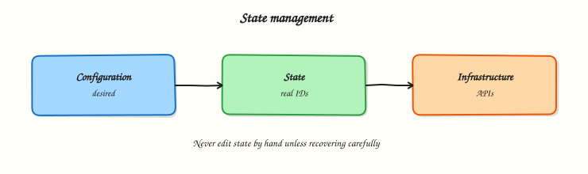

# Terraform State Fundamentals

## Overview

Terraform configuration describes **desired** infrastructure; **state** records **actual** infrastructure Terraform manages. Without accurate state, plans become destructive guesses — duplicate creates, orphaned deletes, or updates against the wrong resource IDs.

This tutorial covers **local state** (`terraform.tfstate`), **state commands** (`list`, `show`, `mv`, `rm`, `pull`, `push`), **drift detection**, and **state security** basics. Remote backends and locking are covered in the next tutorial; here you operate under `~/rebash-terraform/module-08` with **kreuzwerker/docker** and real containers.

This is **Tutorial 8** in **Module 8: State Management** of the REBASH Academy **Terraform for Cloud & DevOps Engineers** series.

## Prerequisites

- [Variables, Locals, and Outputs](variables-locals-and-outputs.md)
- Terraform CLI ≥ 1.5
- Completed Module 7 lab

## Learning Objectives

By the end of this tutorial, you will be able to:

- [ ] Explain what Terraform state stores and why it must be protected
- [ ] Inspect state with `terraform state list` and `terraform state show`
- [ ] Rename and remove state entries with `terraform state mv` and `terraform state rm`
- [ ] Detect drift with `terraform plan` and `terraform refresh`
- [ ] Describe risks of manual state edits and missing backups

## Architecture

Terraform Core reads configuration and state, compares to provider-reported reality, and writes an updated state file after successful apply.



## Theory

### What it is

**State** is a JSON document (by default `terraform.tfstate` in the working directory) mapping Terraform addresses to real-world resource IDs and metadata:

```json
{
  "resources": [
    {
      "type": "docker_container",
      "name": "app",
      "instances": [{ "attributes": { "id": "123456789" } }]
    }
  ]
}
```

Each managed resource has an **address** like `docker_container.app`. State enables Terraform to know which cloud object corresponds to which block in your `.tf` files.

**Local state** stores the file on disk next to your configuration. It is fine for solo learning; teams quickly move to **remote state** (next tutorial).

### Why it matters

If state is lost, Terraform forgets what it manages — the next plan may try to **create duplicates**. If state is leaked, attackers gain resource IDs, sometimes secrets, and network topology. If state drifts from reality (manual console changes), plans may propose wrong updates or destroys. State operations belong in runbooks alongside backup and restore.

### How it works

1. **`terraform apply`** — provider creates/updates resources; Core writes new state.
2. **`terraform plan`** — Core reads state + config; provider refreshes current attributes; Core computes diff.
3. **`terraform refresh`** (or refresh during plan) — updates state attributes from live APIs without applying config changes.
4. **State commands** — manipulate the state file without changing real infrastructure (when used correctly).

| Command | Purpose |
|---------|---------|
| `terraform state list` | Addresses in state |
| `terraform state show ADDR` | One resource instance |
| `terraform state mv SRC DST` | Rename address in state |
| `terraform state rm ADDR` | Remove from state (resource may still exist!) |
| `terraform state pull` | Print raw JSON to stdout |
| `terraform state push` | Write JSON to backend (dangerous — expert use) |

**Drift** is when live infrastructure differs from configuration. `terraform plan` shows drift as update or replace actions. Unmanaged manual changes are a common source.

### Key concepts and comparisons

| Concept | Local state | Remote state (preview) |
|---------|-------------|------------------------|
| Storage | `terraform.tfstate` on laptop | S3, Azure Blob, GCS, Terraform Cloud |
| Collaboration | Poor — file conflicts | Shared backend + locking |
| Security | File permissions only | IAM + encryption at rest |
| Backup | You copy the file | Versioning on bucket |

| Operation | Changes real infra? | Changes state? |
|-----------|---------------------|----------------|
| `apply` | Yes | Yes |
| `state mv` | No | Yes |
| `state rm` | No | Yes (orphan risk) |
| `refresh` | No | Yes (attribute sync) |

### Common pitfalls

- **`terraform state rm` then forget** — resource still running, no longer managed; duplicates on next import attempt.
- **Committing state to Git** — may contain secrets; use remote backend and `.gitignore`.
- **Copying state between environments** — prod IDs in dev workspace causes catastrophic plans.
- **Manual JSON edits** without backup — corrupt state stops all operations.
- **Assuming refresh fixes drift** — refresh updates state to match reality; you still need apply to align reality to config.

## Hands-on Lab

### Objective

Apply a Docker stack, inspect and manipulate local state with official CLI commands, detect drift after a manual container label change, perform a controlled rename with `state mv`, and archive evidence under `~/rebash-terraform/module-08`.

### Prerequisites

- **Terraform ≥ 1.5**
- **Docker Engine running** (`docker info` succeeds)
- `jq` optional (evidence script uses grep)

### Lab environment

Workspace: `~/rebash-terraform/module-08`

```bash title="Terminal"
mkdir -p ~/rebash-terraform/module-08 && cd ~/rebash-terraform/module-08
```

### Real-world scenario

An engineer renamed a resource in code without `terraform state mv`, causing a destroy/create in plan. Ticket **SRE-408**: practice safe state inspection on a real nginx container, perform a controlled rename with `state mv`, and prove drift detection when someone changed a container label outside Terraform.

### Step-by-step tasks

#### Task 1 – Apply baseline stack and inspect state

Create `versions.tf`:

```hcl title="versions.tf"
terraform {
  required_version = ">= 1.5.0"

  required_providers {
    docker = {
      source  = "kreuzwerker/docker"
      version = "~> 3.0"
    }
  }
}

provider "docker" {}
```

Create `main.tf`:

```hcl title="main.tf"
resource "docker_network" "app" {
  name = "rebash-module-08-net"
}

resource "docker_image" "nginx" {
  name = "nginx:1.27-alpine"
}

resource "docker_container" "app" {
  name  = "rebash-module-08-app"
  image = docker_image.nginx.image_id

  networks_advanced {
    name = docker_network.app.name
  }

  labels {
    label = "revision"
    value = "v1"
  }
}
```

Create `outputs.tf`:

```hcl title="outputs.tf"
output "container_name" {
  value = docker_container.app.name
}
```

Run:


```bash title="Terminal"
cd ~/rebash-terraform/module-08
terraform init
terraform apply -auto-approve
terraform state list | tee state-list.txt
grep -q 'docker_container.app' state-list.txt
grep -q 'docker_network.app' state-list.txt
terraform state show docker_container.app | tee state-show-app.txt
grep -q 'revision' state-show-app.txt
docker ps --filter name=rebash-module-08-app --format '{{.Names}}' | grep -q rebash-module-08-app
echo "task1 OK" | tee task1-ok.txt
```


!!! example "Expected output"
    Two resources in state list; container running; `state show` displays labels; `task1-ok.txt` contains `task1 OK`.


#### Task 2 – Rename resource address with state mv

Rename in configuration — replace the `docker_container` block label in `main.tf` from `app` to `application` (keep the same container `name` attribute):

```hcl
resource "docker_container" "application" {
  name  = "rebash-module-08-app"
  image = docker_image.nginx.image_id

  networks_advanced {
    name = docker_network.app.name
  }

  labels {
    label = "revision"
    value = "v1"
  }
}
```

Update `outputs.tf`:

```hcl title="outputs.tf"
output "container_name" {
  value = docker_container.application.name
}
```

Move state to match renamed resource:


```bash title="Terminal"
cd ~/rebash-terraform/module-08
terraform state mv docker_container.app docker_container.application
terraform state list | tee state-list-after-mv.txt
grep -q 'docker_container.application' state-list-after-mv.txt
! grep -q 'docker_container.app' state-list-after-mv.txt
terraform plan -detailed-exitcode -out=/dev/null
docker ps --filter name=rebash-module-08-app --format '{{.Names}}' | grep -q rebash-module-08-app
echo "task2 OK" | tee task2-ok.txt
```


!!! example "Expected output"
    No create/destroy for the renamed container; plan exit code 0; same container still running; `task2-ok.txt` contains `task2 OK`.


#### Task 3 – Detect drift via label change and apply replacement

Update the revision label in `main.tf`:

```hcl
  labels {
    label = "revision"
    value = "v2"
  }
```

Run:


```bash title="Terminal"
cd ~/rebash-terraform/module-08
terraform plan -no-color | tee plan-drift.txt
grep -E 'must be replaced|forces replacement|docker_container.application' plan-drift.txt
terraform apply -auto-approve
docker inspect rebash-module-08-app --format '{{index .Config.Labels "revision"}}' | grep -q v2
echo "task3 OK" | tee task3-ok.txt
```


!!! example "Expected output"
    Plan shows replacement due to label change (forces replacement on container); after apply, label is `v2`; `task3-ok.txt` contains `task3 OK`.


#### Task 4 – State pull evidence script

Create `state-evidence.sh`:


```bash title="Terminal"
#!/usr/bin/env bash
set -euo pipefail
cd ~/rebash-terraform/module-08
terraform state list | grep -q docker_container.application
terraform state pull | tee state-pulled.json
grep -q '"type": "docker_container"' state-pulled.json
terraform output -raw container_name | grep -q rebash-module-08-app
docker ps --filter name=rebash-module-08-app --format '{{.Names}}' | grep -q .
echo "state-evidence PASS" | tee state-evidence-pass.txt
```


Run:

```bash title="Terminal"
chmod +x ~/rebash-terraform/module-08/state-evidence.sh
~/rebash-terraform/module-08/state-evidence.sh
```

!!! example "Expected output"
    `state-evidence-pass.txt` contains `state-evidence PASS`; `state-pulled.json` is valid state JSON.


### Validation steps

- [ ] Applied stack and listed resources in state
- [ ] Renamed resource with `terraform state mv` without recreate
- [ ] Plan detected label drift and applied replacement
- [ ] `terraform state pull` exported JSON evidence
- [ ] `docker ps` confirmed container throughout

### Common errors and fixes

| Error | Cause | Fix |
|-------|-------|-----|
| `state mv` source not found | Wrong address or typo | Run `terraform state list` first |
| Plan wants destroy+create after rename | Skipped `state mv` | Move state to match new resource name |
| Empty state list | Wrong directory | `cd` to root module with `.tf` files |
| Corrupt state JSON | Manual edit error | Restore from backup; avoid hand-editing |
| `state rm` then duplicate create | Resource still exists in Docker | Import or delete real container first |

### Challenge exercise

Remove the network from state without deleting it from Docker:


```bash title="Terminal"
cd ~/rebash-terraform/module-08
terraform state rm docker_network.app
terraform state list | tee state-list-challenge.txt
! grep -q 'docker_network.app' state-list-challenge.txt
docker network ls --filter name=rebash-module-08-net --format '{{.Name}}' | grep -q rebash-module-08-net
echo "state rm challenge OK"
```


!!! example "Expected output"
    Network still exists in Docker; Terraform no longer tracks `docker_network.app` — next plan may propose import or recreate.


### Learning outcomes

- Read state addresses and attributes confidently
- Safe rename workflow with `state mv` on real containers
- Drift visible in plan output when labels change
- State pull for backup/automation patterns

### Cleanup

```bash title="Terminal"
cd ~/rebash-terraform/module-08
terraform destroy -auto-approve
rm -f state-list.txt state-show-app.txt task*-ok.txt state-list-after-mv.txt \
  plan-drift.txt state-pulled.json state-evidence-pass.txt state-list-challenge.txt
rm -rf .terraform .terraform.lock.hcl terraform.tfstate terraform.tfstate.backup
```

## Validation

- [ ] Completed module-08 state lab with `docker ps` evidence
- [ ] Can explain what happens if state is deleted
- [ ] Used `state mv` without unnecessary replacement
- [ ] Can describe difference between refresh and apply

## Code Walkthrough

1. **State list before surgery** — always capture addresses before `mv`/`rm`.
2. **Rename in code + state mv together** — never apply a rename without moving state.
3. **Plan as diff ticket** — read replacement lines; label changes on `docker_container` force replace.
4. **State pull for backups** — pipe JSON to secure storage before risky operations.
5. **Never commit state** — `.gitignore` `*.tfstate*` locally until remote backend is configured.

## Security Considerations

- State may contain sensitive attributes even when outputs are marked sensitive — encrypt and restrict access.
- Do not store state in public Git repositories.
- Limit who can run `terraform state rm` — it enables orphan resources and takeover via import.
- Backup state before manual operations; version remote backends in production.
- Audit state access the same as production credentials.

## Common Mistakes

!!! warning "Renaming resources without state mv"
    Terraform plans destroy/create because the address changed.  
    **Fix:** `terraform state mv old.address new.address` immediately after code rename.

!!! warning "Using state rm to 'fix' a bad plan"
    Removes management without destroying the resource — duplicates follow.  
    **Fix:** Use `terraform import` or destroy the real resource deliberately.

!!! warning "Sharing state files between teammates via email"
    No locking; last writer wins; secrets leak.  
    **Fix:** Remote backend with locking (next tutorial).

## Best Practices

- Back up state before `mv`, `rm`, or `push` operations.
- Treat `terraform.tfstate` as confidential data at rest.
- Use consistent resource naming; prefer `for_each` keys over frequent renames.
- Run `terraform plan` in CI for every change — drift becomes visible early.
- Document state migration steps in pull requests for reviewer sign-off.

## Troubleshooting

| Symptom | Likely cause | Fix |
|---------|--------------|-----|
| Plan wants to create existing resource | State lost or wrong workspace | Restore backup; verify directory |
| `state mv` fails | Destination exists | Choose unused destination address |
| Unexpected replace | Trigger or force-new attribute changed | Review plan; adjust lifecycle if intentional |
| Empty output after apply | Output references wrong resource name | Fix output block after rename |
| State file huge | Many resources or long attributes | Split stacks; remote state with pruning |

## Summary

State is Terraform's memory of managed infrastructure. You inspected local state, renamed resources safely with `state mv`, detected drift through plans, and exported JSON with `state pull`. Next, [Remote State and Backends](remote-state-and-backends.md) moves state off laptops into shared, lockable storage.

## Interview Questions

**1. What does Terraform state contain?**

??? success "Reveal answer"
    Mappings from **resource addresses** (like `aws_instance.web`) to **provider-specific IDs and attributes**, plus metadata (serial, lineage, outputs). It is the source of truth for what Terraform believes it manages — not the desired configuration file alone.

**2. What happens if you delete the state file but resources still exist?**

??? success "Reveal answer"
    Terraform **forgets** those resources. The next plan typically proposes **creating new ones**, risking **duplicates** and naming conflicts. Recovery paths include **restore from backup**, **`terraform import`**, or manual destroy outside Terraform — all painful in production.

**3. When do you use `terraform state mv`?**

??? success "Reveal answer"
    When you **rename** a resource or **move** it into/out of a module without destroying the real infrastructure. It updates the address in state to match refactored code. Always pair code renames with `state mv` before apply.

**4. What is the difference between `terraform refresh` and `terraform apply`?**

??? success "Reveal answer"
    **Refresh** updates **state attributes** from the provider APIs to match reality — it does not apply configuration changes. **Apply** reconciles **infrastructure to configuration** and updates state accordingly. Refresh alone does not fix drift relative to your `.tf` files.

**5. What risks does `terraform state rm` introduce?**

??? success "Reveal answer"
    The real resource **still exists** but Terraform **stops managing** it. The next apply may **create a duplicate**. Use `rm` only when orphaning is intentional (handover to another tool) or before import into a different stack.

**6. How do you detect drift in a pipeline?**

??? success "Reveal answer"
    Run **`terraform plan`** on a schedule or every merge. Non-empty plans indicate drift or pending changes. Some teams fail CI when plan is not empty on protected branches. Pair with policy checks and alerting on unexpected diffs.

**7. Why should state files be encrypted and access-controlled?**

??? success "Reveal answer"
    State often holds **resource IDs**, **network layout**, and sometimes **secrets** or derived sensitive values. Leaked state helps attackers map and target infrastructure. Encryption at rest and IAM/RBAC on the backend are baseline production requirements.

**8. Local state vs remote state — when is local acceptable?**

??? success "Reveal answer"
    **Local** is acceptable for **individual learning**, throwaway labs, and quick prototypes. **Teams** need **remote state** for collaboration, locking, versioning, and centralized security. Production always uses remote backends with encryption and least-privilege IAM.

## Related Tutorials

- [Terraform course index](index.md)
- **Previous:** [Variables, Locals, and Outputs](variables-locals-and-outputs.md)
- **Next:** [Remote State and Backends](remote-state-and-backends.md)
- [Troubleshooting Terraform](troubleshooting-terraform.md)

## References

- [State](https://developer.hashicorp.com/terraform/language/state)
- [State commands](https://developer.hashicorp.com/terraform/cli/commands/state)
- [Import](https://developer.hashicorp.com/terraform/cli/import)
- [Sensitive data in state](https://developer.hashicorp.com/terraform/language/state/sensitive-data)
