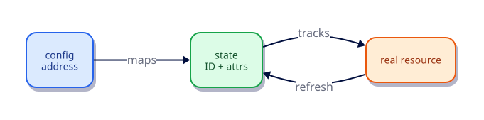

# Terraform State Fundamentals

## Overview

State is Terraform’s memory: a mapping from configuration addresses to real-world IDs and attributes. Understanding state is mandatory before remote backends, workspaces, or team workflows.

This is **Tutorial 8** in **Module 2: Core Building Blocks** of the REBASH Academy Terraform track.

## Learning Objectives

By the end of this tutorial, you will be able to:

- [ ] Describe what state stores and why it exists
- [ ] Use state list/show/pull safely
- [ ] Explain refresh and drift detection
- [ ] Avoid committing sensitive state to Git
- [ ] Recognize state backup files

## Prerequisites

- Completed Dependencies and the Resource Graph

- Terraform CLI **1.9+** (1.15.x recommended)
- Ability to create directories and edit files

## Architecture




## Theory

### Why state?

Cloud APIs do not know your resource addresses (`aws_instance.web`). State binds addresses to IDs.

### Contents (conceptual)

- Resource mode/type/name/index
- Provider attribution
- Attributes (often including secrets!)
- Dependencies

### Local files

- `terraform.tfstate` — current
- `terraform.tfstate.backup` — previous write

### CLI

- `terraform state list`
- `terraform state show ADDRESS`
- `terraform state pull` (JSON to stdout)

### Why this topic matters in production

Teams that skip **Terraform state as the mapping between config and reality** eventually pay in outages: unreviewable plans, brittle
refactors, or secrets leaking into logs. Treat this tutorial as the minimum bar for merging
Terraform changes on a shared state file.

### Practical mental model

1. Write the smallest config that proves the idea
2. `fmt` / `validate` / `plan` until the diff matches your intent
3. Apply only after you can explain every create/update/replace line
4. Destroy lab resources so the next exercise starts clean

## Hands-on Lab

```hcl
terraform {
  required_version = ">= 1.9.0"
  required_providers {
    local = {
      source  = "hashicorp/local"
      version = "~> 2.9"
    }
  }
}

resource "local_file" "tracked" {
  filename = "${path.module}/tracked.txt"
  content  = "state-lab\n"
}
```

```bash
terraform init -input=false && terraform apply -input=false -auto-approve
terraform state list
terraform state show local_file.tracked
terraform state pull | head -c 400; echo
terraform destroy -input=false -auto-approve
```

## Code Walkthrough

After apply, state show prints attributes Terraform tracks — including file content for local_file.


Re-read every argument in the lab through the lens of **Terraform state as the mapping between config and reality**.
For each resource address, ask: what happens on the next plan if I change this value?
Update in place, replace, or no-op? That habit is how you avoid surprise destroys.

## Validation

Run the lab to completion, then confirm:

```bash
terraform fmt -check
terraform init -input=false
terraform validate
terraform plan -input=false
```

| Check | Pass criteria |
|-------|----------------|
| Formatting | `fmt -check` exits 0 |
| Configuration | `validate` succeeds after init |
| Intent | Plan matches the tutorial’s expected creates/updates only |
| Topic focus | You can explain how this lab demonstrates Terraform state as the mapping between config and reality |
| Cleanup | Destroy (or documented teardown) left no stray lab files |

## Best Practices

- Keep examples small enough to run without cloud credentials unless the topic requires otherwise
- Document assumptions (CLI version, providers, working directory) at the top of the root module
- Prefer explicitness over cleverness when teaching **Terraform state as the mapping between config and reality**
- Add CI checks (`fmt`, `validate`, plan) as soon as a root is shared
- Write outputs that help the next human debug, not just the next machine

## Security Considerations

- Assume state and plan output may contain secrets related to **Terraform state as the mapping between config and reality**
- Use least-privilege credentials whenever a provider needs authentication
- Do not commit tfvars with real secrets; use examples with placeholders
- Review plans for unexpected destroys before apply
- Limit who can unlock state and who can approve production applies

## Common Mistakes

!!! warning "Hand-editing state JSON"
    Corruption. **Fix:** Use state CLI / import / moved.

!!! warning "Emailing tfstate"
    Secret sprawl. **Fix:** Remote backends + IAM.

## Troubleshooting

| Issue | Cause | Solution |
|-------|-------|----------|
| validate fails | Missing init or syntax error | Run `terraform init`, read the file:line in the error |
| Plan shows replace unexpectedly | ForceNew argument changed | Confirm intent; use moved/lifecycle if refactoring |
| Provider auth errors | Credentials not available | Export the documented env vars for the provider |
| Topic confusion around Terraform state as the mapping between config and reality | Skipped theory | Re-read Theory, then re-run the lab from a clean directory |
| Leftover lab files | Destroy skipped | Re-run destroy or delete the lab directory after state cleanup |

## Interview Questions

1. What does state store, and why is it required?
2. How do you inspect a resource in state without applying?
3. What is refresh, and when does it run?
4. Why is state sensitive even for local_file labs?
5. What is terraform.tfstate.backup for?
6. How does drift appear in a plan?
7. When would you use terraform state rm?
8. Why is editing state JSON by hand dangerous?
9. How does state relate to resource addresses?
10. What changes when you move to a remote backend?
11. How do you recover from a lost local state file in a lab?
12. Why exclude *.tfstate* from Git?

## Summary

- Master **Terraform state as the mapping between config and reality** before moving to the next tutorial in the track
- Every shared root needs formatting, validation, and a reviewed plan
- Prefer small, reversible labs that you can destroy confidently
- Carry security and state hygiene forward into every later module

## Related Tutorials

- Track overview: [Terraform](index.md)
- Previous: [Dependencies and the Resource Graph](dependencies-and-the-resource-graph.md)
- Next: [Remote State and Backends](remote-state-and-backends.md)
- Cheat sheet: [Terraform Cheat Sheet](../cheatsheets/terraform.md)
- Interview prep: [Terraform Interview Prep](../interview/terraform.md)
- Learning path: [DevOps Engineer](../learning-paths/devops-engineer.md)

## References

1. [Terraform documentation](https://developer.hashicorp.com/terraform/docs)
2. [Terraform CLI commands](https://developer.hashicorp.com/terraform/cli/commands)
3. [Terraform language](https://developer.hashicorp.com/terraform/language)
4. [Terraform Registry](https://registry.terraform.io/)
5. [Version constraints](https://developer.hashicorp.com/terraform/language/expressions/version-constraints)
