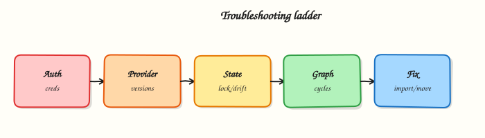

# Troubleshooting Terraform

## Overview

Most Terraform failures are not mysterious — they cluster into a short list: bad credentials, provider version skew, configuration reference errors, state lock contention, drift from console edits, dependency cycles, or partial apply corruption. A fixed triage order (auth → init → validate/plan → lock → drift → graph → state recovery) saves hours during change windows.

This is **Tutorial 20** in **Module 20: Troubleshooting** of the REBASH Academy **Terraform for Cloud & DevOps Engineers** series — written for Cloud, DevOps, Platform, and SRE engineers. Reference: [Debugging Terraform](https://developer.hashicorp.com/terraform/internals/debugging).

## Prerequisites

- [Production Terraform Patterns](production-terraform-patterns.md)
- [Terraform State Fundamentals](terraform-state-fundamentals.md)
- [Format, Validate, and Terraform Test](format-validate-and-terraform-test.md)

## Learning Objectives

By the end of this tutorial, you will be able to:

- [ ] Classify failures by layer: auth, config, lock, drift, graph, or state
- [ ] Fix validate errors and capture before/after evidence
- [ ] Interpret plans that want recreate after `state rm` or rename
- [ ] Use `moved` and understand when `import` is appropriate
- [ ] Enable targeted debug logging without leaking secrets

## Architecture

Failures originate in credentials, provider plugins, HCL references, state backends, or the dependency graph. Recovery tools (`import`, `state rm`, `moved`) sit at the end of the ladder — not the start.



## Theory

### What it is

**Troubleshooting Terraform** follows layers:

| Symptom | First checks |
|---------|----------------|
| Auth / 401 / 403 | Credentials, OIDC, IAM, subscription/project |
| Provider download / schema | `init`, version pins, registry access |
| Validate / reference errors | Typos, wrong module outputs, type mismatches |
| State lock | Who holds the lock; CI overlap; crash mid-apply |
| Drift | Console changes; unexpected plan updates |
| Cycle errors | Mutual `depends_on` or references |
| Slow plans | Huge roots, remote data sources, chatty APIs |
| State inconsistency | Partial failure; object missing from API |

Recovery tools:

| Tool | Effect |
|------|--------|
| `import` | Bind real ID → Terraform address |
| `state rm` | Forget address (resource may still exist in cloud) |
| `moved` | Rename address without replace |
| Backend version restore | Roll back corrupted state object |

### Why it matters

Mean time to recovery depends on not confusing a bad variable with a bad backend. Platform on-call needs a fixed order juniors can follow under pressure. The same playbook feeds CI: catch validate and provider issues before apply, and treat `force-unlock` and state surgery as last resorts with audit notes.

### How it works

Use this order every time:

1. **Auth** — can the runner assume the role / use the subscription? Clock skew? Wrong account?
2. **Init** — `terraform init`; confirm provider versions match lock file.
3. **Validate / plan** — read the first error; fix config before touching state.
4. **Lock** — if lock error, identify the holder; wait or `force-unlock` only when sure the other process is dead.
5. **Drift** — unexpected updates/deletes → decide re-apply desired state vs update config to match reality.
6. **Graph** — cycle messages → break mutual dependencies; prefer data flow over blanket `depends_on`.
7. **State recovery** — restore backend version; then consider `import` / `state rm` / `moved` with a saved plan.
8. **Performance** — split roots, cache providers, reduce refresh scope.

Separate three questions: Does config parse? Does state match reality? Did the API reject the call?

### Key concepts and comparisons

| Failure class | Looks like | Not fixed by |
|---------------|------------|--------------|
| Auth | 403 / invalid token | Reformatting HCL |
| Config | Unknown resource / invalid ref | `force-unlock` |
| Lock | state locked by … | Random `state rm` |
| Drift | Perpetual plan changes | Ignoring and re-applying blind |
| Cycle | `Cycle: …` | More `depends_on` both ways |
| API / provider | Retryable 5xx or clear API error | Editing unrelated outputs |

### Common pitfalls

- Jumping to `force-unlock` while another apply is healthy — **Fix:** confirm the holder process is dead.
- `state rm` then apply creating duplicate databases — **Fix:** understand recreate semantics; prefer `import` when object exists.
- Fixing production with console edits Terraform will fight forever — **Fix:** revert console change or import and align config.
- Assuming `-refresh=false` fixes drift — **Fix:** it hides drift temporarily; reconcile properly.
- Expanding one root until plans take thirty minutes — **Fix:** split state by blast radius.

## Hands-on Lab

### Objective

Reproduce and fix a configuration validate failure, demonstrate recreate behaviour after `terraform state rm` on a **Docker container**, refactor safely with `moved`, and capture debug logs with a triage script under `~/rebash-terraform/module-20`.

### Prerequisites

- Terraform CLI ≥ 1.5
- Docker Engine running (`docker info` succeeds)

### Lab environment

Workspace: `~/rebash-terraform/module-20`

```bash title="Terminal"
mkdir -p ~/rebash-terraform/module-20/{configs,evidence,scripts}
```

Local Terraform with **Docker** provider.

### Real-world scenario

A teammate pushed a hotfix during an incident and bypassed CI. The root fails `terraform validate`, and after a manual state edit the next plan wants to recreate a running container. You reproduce the failure, fix configuration, demonstrate state recovery semantics on real Docker resources, and leave a triage script the team can run on every alert.

### Step-by-step tasks

#### Task 1 – Reproduce a validate failure and capture evidence

Create `configs/broken/versions.tf`:

```hcl title="versions.tf"
terraform {
  required_version = ">= 1.5.0"
  required_providers {
    docker = {
      source  = "kreuzwerker/docker"
      version = "~> 3.0"
    }
  }
}
```

Create `configs/broken/providers.tf`:

```hcl title="providers.tf"
provider "docker" {}
```

Create `configs/broken/main.tf` with an intentional reference error:

```hcl
resource "docker_image" "app" {
  name = "nginx:1.27-alpine"
}

resource "docker_container" "app" {
  name  = "rebash-troubleshoot-${var.release_version}"
  image = docker_image.app.image_id
}

# variable block intentionally missing — validate should fail
```

Run validate and save failure output:

```bash title="Terminal"
cd ~/rebash-terraform/module-20/configs/broken
terraform init -input=false
terraform validate > ../../evidence/validate-before.txt 2>&1 || true
grep -Ei 'undeclared|reference|variable' ../../evidence/validate-before.txt
```

!!! example "Expected output"
    Non-zero exit; log mentions undeclared `var.release_version`.


#### Task 2 – Fix configuration and prove validate passes

Create `configs/fixed/versions.tf` (same as broken).

Create `configs/fixed/providers.tf`:

```hcl title="providers.tf"
provider "docker" {}
```

Create `configs/fixed/variables.tf`:

```hcl title="variables.tf"
variable "release_version" {
  type    = string
  default = "1.0.0"
}
```

Create `configs/fixed/main.tf`:

```hcl title="main.tf"
resource "docker_image" "app" {
  name         = "nginx:1.27-alpine"
  keep_locally = true
}

resource "docker_container" "app" {
  name  = "rebash-troubleshoot-${var.release_version}"
  image = docker_image.app.image_id

  labels = {
    release = var.release_version
  }
}

output "release" {
  value = var.release_version
}

output "container_name" {
  value = docker_container.app.name
}
```

Run validate:

```bash title="Terminal"
cd ~/rebash-terraform/module-20/configs/fixed
terraform init -input=false
terraform validate | tee ../../evidence/validate-after.txt
grep -q 'Success' ../../evidence/validate-after.txt
```

!!! example "Expected output"
    `Success! The configuration is valid.`


#### Task 3 – Apply, remove from state, and observe recreate plan

Apply the fixed configuration:


```bash title="Terminal"
cd ~/rebash-terraform/module-20/configs/fixed
terraform apply -auto-approve
terraform state list | tee ../../evidence/state-list.txt
grep -q 'docker_container.app' ../../evidence/state-list.txt
docker ps --filter "name=rebash-troubleshoot-1.0.0" --format '{{.Names}}' \
  | tee ../../evidence/container-before-rm.txt
grep -q 'rebash-troubleshoot-1.0.0' ../../evidence/container-before-rm.txt
```


Remove the resource from state without destroying the container:


```bash title="Terminal"
cd ~/rebash-terraform/module-20/configs/fixed
terraform state rm docker_container.app
terraform state list | tee ../../evidence/state-after-rm.txt
! grep -q 'docker_container.app' ../../evidence/state-after-rm.txt
docker ps --filter "name=rebash-troubleshoot-1.0.0" --format '{{.Names}}' \
  | tee ../../evidence/container-still-running.txt
grep -q 'rebash-troubleshoot-1.0.0' ../../evidence/container-still-running.txt
terraform plan -no-color | tee ../../evidence/plan-after-rm.txt
grep -q 'docker_container.app' ../../evidence/plan-after-rm.txt
grep -q 'create' ../../evidence/plan-after-rm.txt
```


!!! example "Expected output"
    Container still running in Docker; state empty of `app`; plan wants to create `docker_container.app` again (name conflict risk — document in interview answer).


Re-apply to restore consistent state (may require removing orphan container first):


```bash title="Terminal"
cd ~/rebash-terraform/module-20/configs/fixed
docker rm -f rebash-troubleshoot-1.0.0 2>/dev/null || true
terraform apply -auto-approve
docker ps --filter "name=rebash-troubleshoot-1.0.0" --format '{{.Names}}' \
  | tee ../../evidence/container-after-reapply.txt
grep -q 'rebash-troubleshoot-1.0.0' ../../evidence/container-after-reapply.txt
```


!!! example "Expected output"
    Container recreated and tracked in state again.


#### Task 4 – Refactor with `moved` after rename

Rename the resource in `configs/fixed/main.tf`:

```hcl
resource "docker_container" "workload" {
  name  = "rebash-troubleshoot-${var.release_version}"
  image = docker_image.app.image_id

  labels = {
    release = var.release_version
  }
}
```

Update outputs:

```hcl
output "container_name" {
  value = docker_container.workload.name
}
```

Create `configs/fixed/moved.tf`:

```hcl title="moved.tf"
moved {
  from = docker_container.app
  to   = docker_container.workload
}
```

Plan and confirm move without destroy:


```bash title="Terminal"
cd ~/rebash-terraform/module-20/configs/fixed
terraform plan -no-color | tee ../../evidence/plan-after-moved.txt
grep -q 'workload' ../../evidence/plan-after-moved.txt
! grep -q 'destroy' ../../evidence/plan-after-moved.txt
terraform apply -auto-approve
docker inspect rebash-troubleshoot-1.0.0 --format '{{.State.Running}}' \
  | tee ../../evidence/container-still-running-after-moved.txt
grep -q 'true' ../../evidence/container-still-running-after-moved.txt
```


!!! example "Expected output"
    Plan shows address move; same container still running (no replace).


#### Task 5 – Collect debug logs with a triage script

Create `scripts/triage.sh`:


```bash title="Terminal"
#!/usr/bin/env bash
set -euo pipefail
ROOT="$(cd "$(dirname "$0")/.." && pwd)"
CONFIG="${1:-$ROOT/configs/fixed}"
LOG="$ROOT/evidence/triage.log"
{
  echo "== $(date -u +%Y-%m-%dT%H:%M:%SZ) triage =="
  echo "-- terraform version --"
  terraform version
  echo "-- docker ps (rebash) --"
  docker ps --filter "name=rebash-troubleshoot" --format '{{.Names}} {{.Status}}'
  echo "-- terraform init --"
  (cd "$CONFIG" && terraform init -input=false)
  echo "-- terraform validate --"
  (cd "$CONFIG" && terraform validate)
  echo "-- terraform plan --"
  (cd "$CONFIG" && terraform plan -input=false -no-color)
} > "$LOG" 2>&1
echo "Wrote $LOG"
```


Run:

```bash title="Terminal"
chmod +x ~/rebash-terraform/module-20/scripts/triage.sh
~/rebash-terraform/module-20/scripts/triage.sh ~/rebash-terraform/module-20/configs/fixed
test -s ~/rebash-terraform/module-20/evidence/triage.log
grep -q 'Plan:' ~/rebash-terraform/module-20/evidence/triage.log
grep -q 'rebash-troubleshoot' ~/rebash-terraform/module-20/evidence/triage.log
```

!!! example "Expected output"
    `evidence/triage.log` contains validate, plan, and docker ps sections.


### Validation steps

- [ ] Captured validate failure in `evidence/validate-before.txt`
- [ ] Fixed config passes validate (`validate-after.txt`)
- [ ] `state rm` left container running but plan wanted recreate
- [ ] `moved` refactor avoided destroy (`plan-after-moved.txt`)
- [ ] `scripts/triage.sh` wrote non-empty `evidence/triage.log`

### Common errors and fixes

| Error | Cause | Fix |
|-------|-------|-----|
| `Reference to undeclared input variable` | Missing `variable` block | Add variable definition and default or tfvars |
| `state rm` then name conflict on apply | Old container still exists | `docker rm -f` orphan before re-apply |
| Plan still wants destroy after rename | Missing `moved` | Add `moved { from = … to = … }` |
| Docker provider connection error | Engine not running | Start Docker before apply |
| Debug log contains secrets | `TF_LOG=DEBUG` with sensitive env | Use ERROR level; redact before sharing |

### Challenge exercise

Extend `scripts/triage.sh` to accept a second argument `strict` that exits non-zero when `terraform plan` output contains `- destroy` on any managed resource.

### Learning outcomes

- Classified validate vs state vs plan failures on real Docker resources
- Fixed configuration errors with before/after evidence
- Demonstrated recreate semantics after `state rm` with operational docker proof
- Applied `moved` for safe address refactor without container replace
- Built a reusable triage script with captured logs

### Cleanup

```bash title="Terminal"
cd ~/rebash-terraform/module-20/configs/fixed
terraform destroy -auto-approve
docker rm -f rebash-troubleshoot-1.0.0 2>/dev/null || true
rm -rf ~/rebash-terraform/module-20/configs/*/.terraform
rm -f ~/rebash-terraform/module-20/configs/*/.terraform.lock.hcl
rm -f ~/rebash-terraform/module-20/configs/*/{terraform.tfstate,terraform.tfstate.backup}
```

## Validation

- [ ] Lab completed under `~/rebash-terraform/module-20/`
- [ ] You can explain the troubleshooting ladder in order
- [ ] You captured evidence files for validate, state rm, and moved
- [ ] You can describe when `force-unlock` is acceptable

## Code Walkthrough

Troubleshooting Terraform in production always combines:

1. **Read the first error** — do not scroll to random Stack Overflow fixes
2. **Fix config before state** — validate/plan must pass before surgery
3. **Backup state** — `terraform state pull` before `rm`, `import`, or `moved`
4. **Apply saved plans** — after recovery, use `-out` plans for evidence
5. **Redact logs** — `TF_LOG=DEBUG` can print credentials; share carefully

Keep runbooks short enough to follow at 02:00; automate checks; keep humans for judgement calls.

## Security Considerations

- Redact tokens and secrets before sharing `TF_LOG` output or plan files
- Restrict who may run `terraform state rm`, `import`, or `force-unlock` in production
- Prefer OIDC-backed CI roles over static keys when reproducing auth failures
- Audit every manual state change in the change ticket system
- Never paste production state JSON into public tickets — it contains sensitive attributes

## Common Mistakes

!!! warning "Jumping to force-unlock while apply is running"
    Unlocking during a healthy apply can corrupt state. **Fix:** confirm the lock holder process is dead; coordinate with CI.

!!! warning "state rm on databases then apply"
    Terraform will attempt to create a second instance. **Fix:** understand recreate semantics; use `import` when the object still exists.

!!! warning "Console hotfix without updating Terraform"
    The next plan reverts or fights manual changes forever. **Fix:** either revert the console edit or update HCL and import.

## Best Practices

- Follow the same triage order in CI pre-checks and on-call runbooks
- Save plan artefacts for every production change
- Pin provider versions to reproduce errors consistently
- Split large roots before optimising refresh — structure beats flags
- Rehearse state recovery in a sandbox quarterly

## Troubleshooting

| Symptom | Likely cause | Fix |
|---------|--------------|-----|
| `Error: configuration invalid` | Syntax or reference error | `terraform validate`; fix first error only |
| Perpetual diff on every plan | Drift or computed attribute churn | Refresh; align config; check `lifecycle ignore_changes` |
| `Cycle` in graph | Mutual dependency | Remove redundant `depends_on`; restructure modules |
| Provider plugin error | Version skew or corrupt cache | `terraform init -upgrade`; align lock file |
| Partial apply, inconsistent state | Network/API failure mid-apply | Refresh; re-plan; restore state backup if needed |
| Plan takes >10 minutes | Monolithic root | Split state; reduce data sources; scope `-target` only for debug |

## Summary

You can design, secure, automate, and operate production Terraform — and diagnose failures by layer instead of guessing. Practise the lab triage script until the validate → plan → state path is muscle memory, then revisit the [course overview](index.md) for capstone and interview prep.

## Interview Questions

**1. What is your triage order when Terraform fails in CI?**

??? success "Reveal answer"
    Auth → init/providers → validate → plan errors → lock → drift → graph cycles → state recovery. Fix configuration before touching state. Never `force-unlock` or `state rm` as first steps.

**2. How do you interpret a resource that must be replaced (`-/+`)?**

??? success "Reveal answer"
    Replacement means Terraform cannot update in place — often from force-new argument changes or provider schema shifts. Expect delete/create side effects, downtime, and possible data loss. Plan mitigation before apply.

**3. What does state inconsistency look like after a partial failure?**

??? success "Reveal answer"
    Some resources exist in cloud but not state (or vice versa). Plans may propose duplicate creates or unexpected destroys. Refresh, compare to reality, then use `import`, `state rm`, or restored backup — always with a saved plan review.

**4. How can `TF_LOG` help, and what must you avoid when sharing logs?**

??? success "Reveal answer"
    `TF_LOG=ERROR` (or DEBUG locally) surfaces provider RPC details and early failures. Debug logs may include tokens and secrets — redact before sharing. Prefer targeted provider logs over dumping full environment variables.

**5. When is `terraform import` appropriate versus `moved`?**

??? success "Reveal answer"
    **`import`** binds an existing real-world object to a Terraform address when config already describes it. **`moved`** renames an address in state during refactors when the same object continues under management. Neither skips plan review.

**6. How do you handle drift detected in a scheduled plan job?**

??? success "Reveal answer"
    Treat drift as an incident signal: identify whether console change, external automation, or provider bug caused it. Either revert the external change or update Terraform config to match the approved new reality — never ignore recurring drift alarms.

## Related Tutorials

- [Course overview](index.md)
- [Production Terraform Patterns](production-terraform-patterns.md)
- [Terraform State Fundamentals](terraform-state-fundamentals.md)
- [Remote State and Backends](remote-state-and-backends.md)

## References

- [Debugging Terraform](https://developer.hashicorp.com/terraform/internals/debugging)
- [State CLI commands](https://developer.hashicorp.com/terraform/cli/commands/state)
- [Import](https://developer.hashicorp.com/terraform/cli/import)
- [Moved block](https://developer.hashicorp.com/terraform/language/modules/develop/refactoring)
