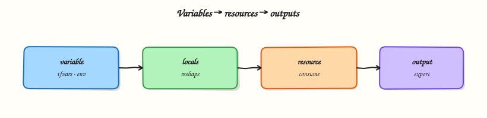

# Variables, Locals, and Outputs

## Overview


Design clean module inputs and outputs: typed variables, validation, tfvars and `TF_VAR_`, locals for derived values, and sensitive outputs that do not leak in logs.

**Variables** are the knobs at the module boundary. **Locals** hold computed values inside the module. **Outputs** export results to the CLI, parent modules, or remote state consumers. Prefer explicit types, descriptions, and validation over undocumented defaults.

This is a core tutorial in **Module 7 · Variables & Outputs** of the REBASH Academy **Terraform for Cloud & DevOps Engineers** series — written for Cloud, DevOps, Platform, and SRE engineers.


## Prerequisites


- [Resources, Dependencies, and Meta-Arguments](resources-dependencies-and-meta-arguments.md)


## Learning Objectives


By the end of this tutorial, you will be able to:

- [ ] Declare typed variables with `validation` blocks  
- [ ] Load values via `.tfvars` and `TF_VAR_`  
- [ ] Use locals for derived names without exposing them as inputs  
- [ ] Mark sensitive outputs and confirm CLI redaction


## Architecture


This topic’s control points and relationships are shown below.




## Theory


### What it is

Input variables are referenced as `var.name`. Declare `type`, `description`, optional `default`, and `validation` so bad values fail before any cloud API call. Values arrive from `-var` / `-var-file`, `*.auto.tfvars`, `terraform.tfvars`, `TF_VAR_<name>` environment variables, then defaults — pick one clear source per pipeline.

**Locals** hold derived expressions (`local.name_prefix`). **Outputs** export values for humans and composition. Set `sensitive = true` on variables or outputs to redact CLI display — state may still store the value, so protect backends separately.

### Why it matters

Typed inputs are the contract between platform modules and application teams. Validation fails fast in CI. Sensitive flags reduce secret printing in pipeline logs. Locals stop copy-pasted string templates from drifting across resources.

### How it works

1. Declare `variable` blocks with types and validation.
2. Supply values with `-var-file=dev.tfvars` or `TF_VAR_environment=stage`.
3. Compute shared names and tags in `locals`.
4. Wire `var.*` / `local.*` into resources; export `output` values.
5. Read results with `terraform output` (use `-json` carefully — it can reveal sensitive values).

Prefer explicit `-var-file` in CI over ambient `terraform.tfvars` so the wrong environment cannot auto-load.

### Key concepts and comparisons

| Construct | Scope | Typical use |
|-----------|-------|-------------|
| `variable` | Module input | Env name, CIDR, size |
| `local` | Internal | Prefixed names, tags |
| `output` | Module export | IDs, endpoints |

| Source | Example |
|--------|---------|
| Default | `default = "dev"` |
| tfvars | `environment = "stage"` |
| CLI | `-var='environment=prod'` |
| Environment | `TF_VAR_environment=prod` |

### Common pitfalls

- Using `any` everywhere — you lose validation and clarity.
- Committing tfvars that contain credentials.
- Expecting `sensitive = true` to encrypt state — it only redacts display.
- Exposing every local as a variable — keep the interface small.


## Hands-on Lab


Create a workspace for this tutorial.

```bash
mkdir -p ~/rebash-terraform/module-07 && cd ~/rebash-terraform/module-07
```

**Focus:** Wire input variables, locals, and outputs cleanly

### Step 1 – Define variables and outputs

```bash
cat > variables.tf <<'EOF'
variable "app_name" {
  type    = string
  default = "demo"
}
variable "tags" {
  type    = map(string)
  default = { team = "platform" }
}
EOF
cat > main.tf <<'EOF'
terraform {
  required_providers {
    local = { source = "hashicorp/local", version = "~> 2.5" }
  }
}
locals {
  label = "${var.app_name}-lab"
}
resource "local_file" "config" {
  filename = "${path.module}/config.json"
  content  = jsonencode({ name = local.label, tags = var.tags })
}
output "config_path" {
  value = local_file.config.filename
}
output "label" {
  value = local.label
}
EOF
cat > terraform.tfvars <<'EOF'
app_name = "payments"
tags = { team = "platform", env = "lab" }
EOF
terraform init
```

### Step 2 – Apply and read outputs

```bash
terraform apply -auto-approve
terraform output
cat config.json
```

### Final step – Cleanup note

```bash
terraform destroy -auto-approve
# Workspace kept for notes; remove with: rm -rf "$(pwd)" when finished
```


## Validation


- [ ] Lab commands run under `~/rebash-terraform/module-07/`
- [ ] You can explain each Theory section in your own words
- [ ] You used modern tooling where it applies to this topic
- [ ] You can describe one production failure mode for this topic


## Code Walkthrough


Production practice for **Variables, Locals, and Outputs** always combines:

1. Inspect before you change (status, plan, logs, dry-run)
2. Prefer reversible, documented changes (Git, IaC, drop-ins, version pins)
3. Capture evidence (command output, pipeline logs) for handovers
4. Prefer current tools and APIs over legacy shortcuts
5. Least privilege — escalate credentials only when required

Keep runbooks short enough to follow under pressure. Automate checks; keep humans for judgement.


## Security Considerations


- Treat credentials and tokens for terraform as privileged — never commit them
- Prefer short-lived auth (OIDC, roles, SSO) over long-lived keys
- Validate blast radius before apply/deploy/delete operations
- Restrict who can approve production changes
- Collect audit logs; limit who can read sensitive traces


## Common Mistakes


!!! warning "Using `any` everywhere — you lose validation and clarity."
    Validate assumptions against the Theory section and official docs before changing production.

!!! warning "Committing tfvars that contain credentials."
    Lab shortcuts (open security groups, admin roles, skip approvals) must not ship unchanged.

!!! warning "Changing production without a rollback path"
    Always know how to revert (previous artefact, prior release, state rollback, DNS failback).


## Best Practices


- Encode Variables, Locals, and Outputs changes as code and review them in pull requests
- Pin versions (images, modules, actions, provider plugins)
- Separate environments with clear promotion gates
- Alert on symptoms with runbooks attached
- Destroy lab resources; tag everything with owner and expiry where possible


## Troubleshooting


| Symptom | Likely cause | Fix |
|---------|--------------|-----|
| Auth / permission denied | Wrong identity, policy, or scope | Check caller identity, roles, and least-privilege policies |
| Timeout / no route | Network, DNS, security group, or endpoint | Trace path, DNS, and allow-lists before retrying |
| Drift / unexpected plan | Manual change or wrong state/workspace | Reconcile desired vs actual; avoid click-ops on managed resources |
| Pipeline/job red | Flaky step, cache, or missing secret | Read failing step logs; bisect recent workflow/config changes |
| Cost spike | Idle load balancer, NAT, oversized compute | Inventory billable resources; stop/delete labs promptly |


## Summary


**Variables, Locals, and Outputs** is essential for Cloud and DevOps engineers working with terraform. Practise the lab until the inspection and change path is muscle memory, then continue the track.


## Interview Questions


1. How do input variables differ from locals?
2. When should an output be marked sensitive?
3. What precedence do tfvars and environment variables follow at a high level?
4. Why can putting secrets in terraform.tfvars committed to Git be dangerous?
5. How do typed variables improve module interfaces?

!!! tip "Sample answer — question 2"
    Outputs marked sensitive are redacted in CLI output but may still exist in state. Use them for credentials you must expose to callers carefully, and protect state storage.

!!! tip "Sample answer — question 4"
    Committed tfvars often leak passwords and keys through Git history. Prefer secret managers, CI-injected TF_VAR_ values, and never commit real secrets.


## Related Tutorials


- [Course overview](index.md)
- [Terraform State Fundamentals](terraform-state-fundamentals.md)


## References


- [Input variables](https://developer.hashicorp.com/terraform/language/values/variables)  
- [Outputs](https://developer.hashicorp.com/terraform/language/values/outputs)
