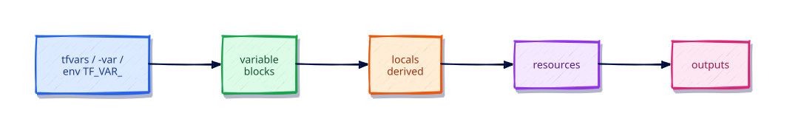

# Variables, Locals, and Outputs

## Overview

Inputs and outputs are the API of every module. This tutorial covers typed variables, validation, value precedence, locals for derived values, and outputs — including `sensitive` handling.

This is **Tutorial 5** in **Module 2: Core Building Blocks** of the REBASH Academy Terraform track.

## Learning Objectives

By the end of this tutorial, you will be able to:

- [ ] Declare typed variables with validation
- [ ] Predict value precedence across tfvars, CLI, and environment
- [ ] Use locals to simplify expressions
- [ ] Export outputs and mark sensitive values
- [ ] Pass values with `TF_VAR_` and `*.auto.tfvars`

## Prerequisites

- Completed Providers and the Terraform Plugin Model

- Terraform CLI **1.9+** (1.15.x recommended)
- Ability to create directories and edit files

## Architecture




## Theory

### Variable precedence (highest wins)

1. `-var` / `-var-file` on the CLI  
2. `*.auto.tfvars` / `*.auto.tfvars.json`  
3. `terraform.tfvars`  
4. Environment `TF_VAR_name`  
5. Default in the `variable` block  

### Validation

```hcl
variable "env" {
  type = string
  validation {
    condition     = contains(["dev", "staging", "prod"], var.env)
    error_message = "env must be dev, staging, or prod."
  }
}
```

### Locals vs variables

Variables are **inputs** (set from outside). Locals are **computed** inside the module.

## Hands-on Lab

```bash
mkdir -p ~/rebash-tf-vars && cd ~/rebash-tf-vars
```

```hcl
terraform {
  required_version = ">= 1.9.0"
  required_providers {
    local = {
      source  = "hashicorp/local"
      version = "~> 2.9"
    }
  }
}

variable "env" {
  type = string
  validation {
    condition     = contains(["dev", "staging", "prod"], var.env)
    error_message = "env must be dev, staging, or prod."
  }
}

variable "app_name" {
  type    = string
  default = "payments"
}

variable "db_password" {
  type      = string
  sensitive = true
}

locals {
  name_prefix = "${var.env}-${var.app_name}"
  note        = "Deploy target for ${local.name_prefix}"
}

resource "local_file" "config" {
  filename = "${path.module}/${local.name_prefix}.cfg"
  content  = <<-EOT
    ${local.note}
    # password length (not value): ${length(var.db_password)}
  EOT
}

output "config_path" {
  value = local_file.config.filename
}

output "db_password" {
  value     = var.db_password
  sensitive = true
}
```

```bash
cat > secret.auto.tfvars <<'EOF'
env         = "dev"
db_password = "not-a-real-secret"
EOF
terraform init -input=false
terraform apply -input=false -auto-approve
terraform output
terraform output -raw db_password
terraform destroy -input=false -auto-approve
rm -f secret.auto.tfvars
```

## Code Walkthrough

Sensitive outputs are redacted in normal CLI UI; `output -raw` still prints them — protect your terminal logs.

Explain every resource argument you introduced in the lab: why it exists, what happens if omitted, and how it appears in state after apply. Keep `required_version` and `required_providers` in every root module you create going forward.

## Validation

```bash
terraform fmt -check
terraform init -input=false
terraform validate
terraform plan -input=false
```

| Check | Pass criteria |
|-------|----------------|
| fmt | Exit code 0 |
| validate | Configuration valid |
| plan/apply | Matches the lab expectations |

## Best Practices

- Keep root modules explicit about `required_version` and `required_providers`
- Prefer readable modules over clever expressions
- Run plans in CI before any production apply
- Document outputs that other stacks consume
- Treat state and plan artifacts as sensitive

## Security Considerations

- Limit who can read remote state
- Do not commit secrets in tfvars or code
- Use least-privilege credentials for providers
- Review plan output for unexpected destroys
- Enable encryption and locking on remote backends when you leave local labs

## Common Mistakes

!!! warning "Putting secrets in defaults"
    They land in Git. **Fix:** No default for secrets; inject via CI/env.

!!! warning "Forgetting `sensitive = true` on outputs"
    Leaks in logs. **Fix:** Mark both variable and output.

## Troubleshooting

| Issue | Cause | Solution |
|-------|-------|----------|
| Provider download fails | Network/registry blocked | Check access to registry.terraform.io |
| validate fails before init | Providers not installed | Run `terraform init` |
| Unexpected replace | ForceNew argument change | Read plan carefully; use moved/for_each wisely |
| State locked | Another apply in progress | Wait or follow backend unlock procedures carefully |
| Permission denied writing files | Directory permissions | Ensure workspace is writable |

## Interview Questions

1. What problem does Variables, Locals, and Outputs solve in a Terraform workflow?
2. How does this topic change what you put in Git versus what stays local or remote?
3. Which official HashiCorp documentation would you consult before changing production?
4. How would you validate a change related to this topic in CI before apply?
5. What failure mode appears if two engineers ignore this topic on the same state?
6. How does this interact with Terraform state?
7. What is a secure default related to this topic?
8. Describe a common anti-pattern and its fix.
9. How would you explain this topic to a teammate in two minutes?
10. What production checklist item captures this topic?
11. When would you intentionally not use the default approach taught here?
12. How does this topic differ between a root module and a child module?

## Summary

- Inputs and outputs are the API of every module. This tutorial covers typed variables, validation, value precedence, locals for derived values, and outputs — including `sensitive` handling.
- Practice the lab until `fmt` / `validate` / `plan` are muscle memory
- Carry forward provider pins, sensitive handling, and plan-before-apply discipline

## Related Tutorials

- Track overview: [Terraform](index.md)
- Previous: [Providers and the Terraform Plugin Model](providers-and-the-terraform-plugin-model.md)
- Next: [Resources and Data Sources](resources-and-data-sources.md)

## References

1. [Terraform documentation](https://developer.hashicorp.com/terraform/docs)
2. [Terraform CLI commands](https://developer.hashicorp.com/terraform/cli/commands)
3. [Terraform language](https://developer.hashicorp.com/terraform/language)
4. [Terraform Registry](https://registry.terraform.io/)
5. [Version constraints](https://developer.hashicorp.com/terraform/language/expressions/version-constraints)
