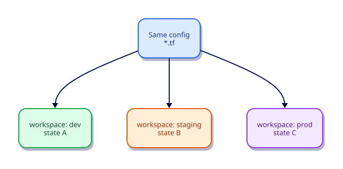

# Workspaces and Environment Strategies

## Overview

Workspaces isolate state for the same configuration. They are useful for light isolation, but many teams prefer separate directories or repositories for prod. Learn both and choose deliberately.

This is **Tutorial 10** in **Module 3: Collaboration and Scale** of the REBASH Academy Terraform track.

## Learning Objectives

By the end of this tutorial, you will be able to:

- [ ] Create and select Terraform workspaces
- [ ] Use terraform.workspace in expressions
- [ ] Explain state isolation per workspace
- [ ] Compare workspaces vs separate root modules
- [ ] Avoid using workspaces as a substitute for proper blast-radius separation

## Prerequisites

- Completed Remote State and Backends

- Terraform CLI **1.9+** (1.15.x recommended)
- Ability to create directories and edit files

## Architecture




## Theory

### CLI

```bash
terraform workspace list
terraform workspace new dev
terraform workspace select dev
```

### When workspaces fit

- Same backend, multiple ephemeral review environments
- Homogeneous regions with tiny deltas

### When to prefer separate roots

- Different providers/accounts for prod
- Different teams/approvers
- Strong blast-radius isolation

### Why this topic matters in production

Teams that skip **workspaces versus separate roots for environments** eventually pay in outages: unreviewable plans, brittle
refactors, or secrets leaking into logs. Treat this tutorial as the minimum bar for merging
Terraform changes on a shared state file.

### Practical mental model

1. Write the smallest config that proves the idea
2. `fmt` / `validate` / `plan` until the diff matches your intent
3. Apply only after you can explain every create/update/replace line
4. Destroy lab resources so the next exercise starts clean

## Hands-on Lab

```hcl
terraform {
  required_version = ">= 1.9.0"
  required_providers {
    local = {
      source  = "hashicorp/local"
      version = "~> 2.9"
    }
  }
}

resource "local_file" "env" {
  filename = "${path.module}/env-${terraform.workspace}.txt"
  content  = "workspace = ${terraform.workspace}\n"
}
```

```bash
terraform init -input=false
terraform workspace new dev || terraform workspace select dev
terraform apply -input=false -auto-approve
terraform workspace new staging || terraform workspace select staging
terraform apply -input=false -auto-approve
ls env-*.txt
terraform workspace select default
```

## Code Walkthrough

Each workspace has its own state key; selecting `staging` does not destroy `dev` objects.


Re-read every argument in the lab through the lens of **workspaces versus separate roots for environments**.
For each resource address, ask: what happens on the next plan if I change this value?
Update in place, replace, or no-op? That habit is how you avoid surprise destroys.

## Validation

Run the lab to completion, then confirm:

```bash
terraform fmt -check
terraform init -input=false
terraform validate
terraform plan -input=false
```

| Check | Pass criteria |
|-------|----------------|
| Formatting | `fmt -check` exits 0 |
| Configuration | `validate` succeeds after init |
| Intent | Plan matches the tutorial’s expected creates/updates only |
| Topic focus | You can explain how this lab demonstrates workspaces versus separate roots for environments |
| Cleanup | Destroy (or documented teardown) left no stray lab files |

## Best Practices

- Keep examples small enough to run without cloud credentials unless the topic requires otherwise
- Document assumptions (CLI version, providers, working directory) at the top of the root module
- Prefer explicitness over cleverness when teaching **workspaces versus separate roots for environments**
- Add CI checks (`fmt`, `validate`, plan) as soon as a root is shared
- Write outputs that help the next human debug, not just the next machine

## Security Considerations

- Assume state and plan output may contain secrets related to **workspaces versus separate roots for environments**
- Use least-privilege credentials whenever a provider needs authentication
- Do not commit tfvars with real secrets; use examples with placeholders
- Review plans for unexpected destroys before apply
- Limit who can unlock state and who can approve production applies

## Common Mistakes

!!! warning "One workspace for prod and dev in same account without guardrails"
    Easy to apply wrong env. **Fix:** Separate accounts or strong CI protections.

## Troubleshooting

| Issue | Cause | Solution |
|-------|-------|----------|
| validate fails | Missing init or syntax error | Run `terraform init`, read the file:line in the error |
| Plan shows replace unexpectedly | ForceNew argument changed | Confirm intent; use moved/lifecycle if refactoring |
| Provider auth errors | Credentials not available | Export the documented env vars for the provider |
| Topic confusion around workspaces versus separate roots for environments | Skipped theory | Re-read Theory, then re-run the lab from a clean directory |
| Leftover lab files | Destroy skipped | Re-run destroy or delete the lab directory after state cleanup |

## Interview Questions

1. What does a Terraform workspace switch under the hood?
2. When are workspaces a poor fit for prod isolation?
3. How do you name workspaces consistently?
4. What is the alternative directory-per-env layout?
5. How do backends interact with workspaces?
6. How would you promote a change from dev to prod?
7. What risks come from using terraform.workspace in resource names?
8. When is a single workspace multi-account design wrong?
9. How do CI pipelines select workspaces?
10. What happens to state if you delete a workspace?
11. How do modules stay environment-agnostic?
12. Compare workspaces with Terragrunt-style roots at a high level.

## Summary

- Master **workspaces versus separate roots for environments** before moving to the next tutorial in the track
- Every shared root needs formatting, validation, and a reviewed plan
- Prefer small, reversible labs that you can destroy confidently
- Carry security and state hygiene forward into every later module

## Related Tutorials

- Track overview: [Terraform](index.md)
- Previous: [Remote State and Backends](remote-state-and-backends.md)
- Next: [Modules — Creating Reusable Infrastructure](modules-creating-reusable-infrastructure.md)
- Cheat sheet: [Terraform Cheat Sheet](../cheatsheets/terraform.md)
- Interview prep: [Terraform Interview Prep](../interview/terraform.md)
- Learning path: [DevOps Engineer](../learning-paths/devops-engineer.md)

## References

1. [Terraform documentation](https://developer.hashicorp.com/terraform/docs)
2. [Terraform CLI commands](https://developer.hashicorp.com/terraform/cli/commands)
3. [Terraform language](https://developer.hashicorp.com/terraform/language)
4. [Terraform Registry](https://registry.terraform.io/)
5. [Version constraints](https://developer.hashicorp.com/terraform/language/expressions/version-constraints)
